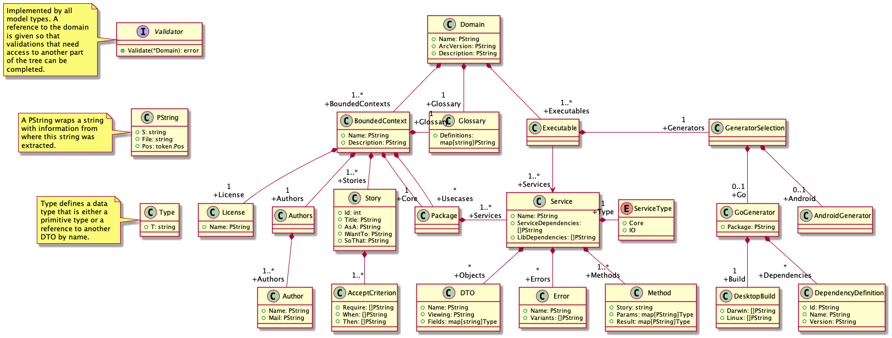

# architecture

## The model

TODO This section is currently just a collection of thoughts, it needs to be rewritten to have a coherent structure. Files for this experiment can be found in `arc/model` and `testdata/supportiety` but might not be up to date.

**Service** Services are either of type *core* or *io*. Core services contain the business logic while io services communicate with the outside world, via a user interface, network, hard drive, etc. To enforce a clean architecture the following rules of communication between services are established:

 * core <-> core is allowed
 * core <-> io is allowed
 * io <-> world is allowed
 * core <-> world is not allowed
 * io <-> io is not allowed

This separation will make sure that data concerning the domain must flow through core services. Ideally we would prevent core services from accessing the network or disk, but this might be hard to enforce in code. Still, programmers should respect this model and we can check for service dependencies that violate these rules in the generator.

To enable communication, each service provides a list of *ServiceDependencies*. These are the names of services it needs access to. When generating the code, the dependency injection layer will provide references to each required service, while not violating the above mentioned communication rules. Dependencies on external libraries can be specified in *LibDependencies*. In this array generator independent dependencies should be specified. E.g. "xml" could be used if the service needs access to an XML-Encoder, or "request" if it needs to make HTTP request. The realizations for these dependencies are given in the generators (DependencyDefinition::ShortName).

**GeneratorSelection** allows an executable to choose what kind of project(s) should be generated for it. In the diagram a *GoGenerator* and an *AndroidGenerator* are shown. The AndroidGenerator is only there to show that different generators could be implemented. In the following only the more complete GoGenerator will be explained. The GoGenerator specifies a package in which the project should be generated into, a list of target platforms to build for and a list of dependencies.

**DependencyDefinition** Each definition consists of a *ShortName*, *Type*, *Name* and *Version*. Name and version will be used to generate a usable dependency. ShortName is the name that services use to reference it. E.g. a ShortName `xml` could be used to reference `encoding/xml` version `1.17`. *Type* should be set appropriately, so that dependencies that communicate with the outside world (like network or disk) are marked `io` and dependencies that do not communicate (like an xml encoder) are marked `core`. This distinction is useful to enforce the communication rules for keeping a clean architecture in section *Service*.

**DTO** Data Transfer Objects are used excessively in this project. They are the only things that can be communicated between services. Whenever some data needs to be transferred, a DTO must be used (hence the name). In this project DTOs are views on an abstract type (specified in `Viewing` in the diagram). This type must be defined in the glossary for the bounded context. A DTO itself is then a manifestation of that type with certain attributes that are only needed in a certain service. E.g. a `User` is described in the glossary. One service might be used for creating users and expects a `RegisterUser(name, email, password)` DTO. It will do some validation and then send a `CreateUser(name, email, password, id)` DTO to the database service to persist the user. When someone wants to look at this user, another service can send a `ShowUser(name)`. Notice how each DTO describes the same concept of a user, but from different views, which is why they would all have the attribute `Viewing="User"` set. This is helpful since e.g. the `ShowUser` DTO should probably not send email and password for a user into the world.